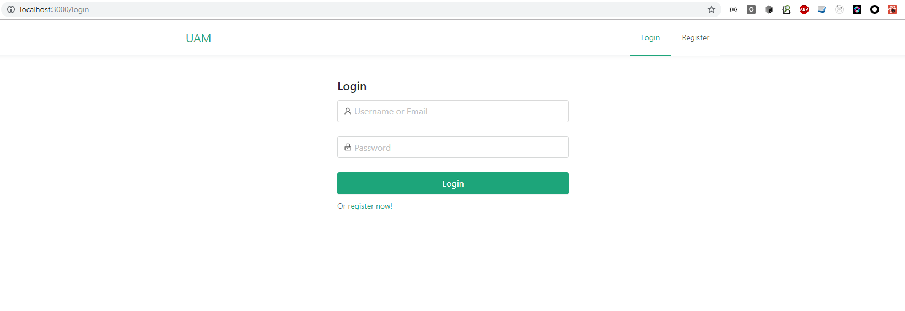
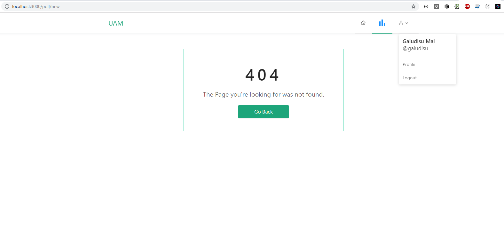

# UAM

UAM(unified access management) refers to an identity management solution. It is used by enterprises to manage digital identities and provide secure access to users across multiple devices and applications, both cloud and on-premise. Unified access management solutions provide a single platform from which IT can manage access across a diverse set of users, devices, and applications, whether on-premise or in the cloud.

UAM is an evolution of identity and access management(IAM) systems. The goal of unified access management is similar to that of identity and access management: manage the identities of individual entities(people, devices, and so on) and their authentication and authorization (roles and privileges) within and across enterprise systems in a secure manner that bolsters productivity.

# Screenshots

login & register

router with redirect.

# Basic theory

- babel
- react+typescript(no eject)
- ant design
- oauth2 (authorization code)
